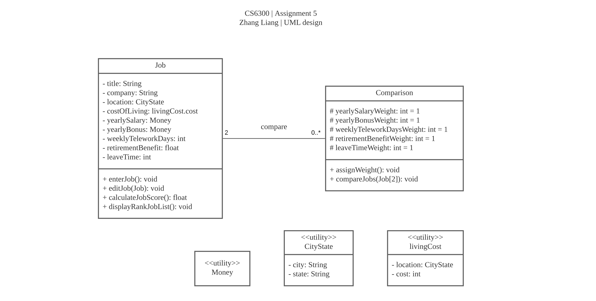
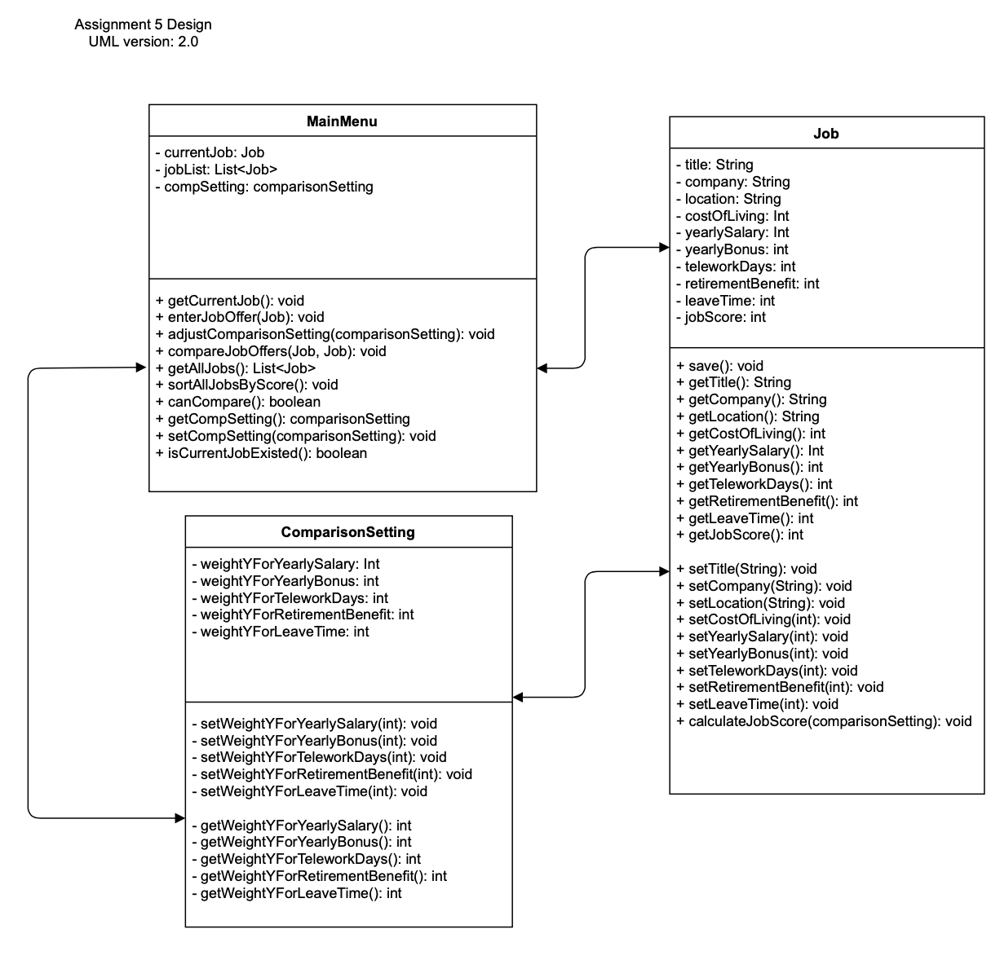
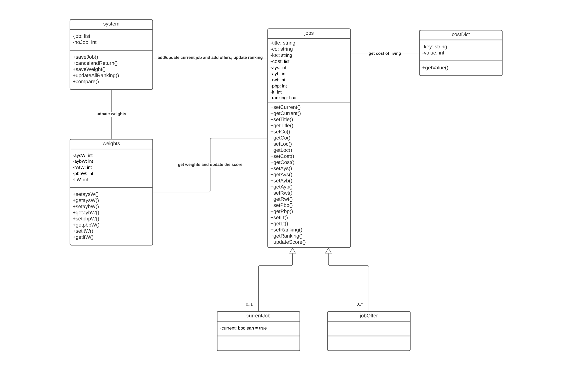
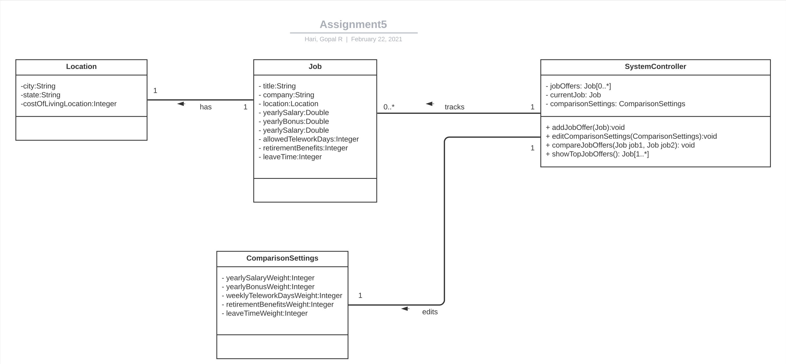
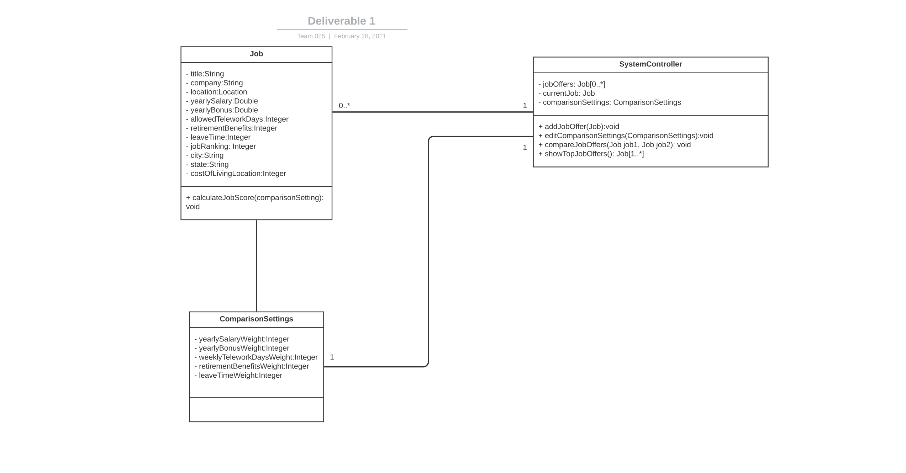

### Design 1

*Author: @zliang98 Zhang Liang*

##### Pros:
* CityState is good to reduce redundancy
* Simple easy to read design

##### Cons:
* Cost of living doesnt need to be its own entity
* Only two classes, missing the controller, main menu class (i.e. entrypoint) where user interactions will be handled
* Job entity methods need to belong to another entity within the system, Job should just represent attributes

---

### Design 2

*Author: @qhan43 Qiwei Han*

##### Pros:
* Nice MainMenu class which represents the state of the system, and operations that can occur within the system
* 

##### Cons:
* Getters/Setters dont need to be included in the UML diagram since they are implied
* Cardinalities need to be included along the arrows of the UML diagram

---

### Design 3

*Author: @ylin648 Ithene Lin*

##### Pros:
* Good job showing relationship between classes (description along relationship lines)

##### Cons:
* Can remove the getters and setters the UML diagram since they're applied
* CurrentJob and JobOffer do not need to be subclasses of the Job class, can be attributes of the System class

---

### Design 4

*Author: @ghari6 Gopal Hari*

##### Pros:
* Nice SystemController class which represents the state of the system, and operations that can occur within the system

##### Cons:
* Missing attribute for jobRanking in Job entity

---

### Team Design

This design has many of the same entities expressed in the other designs (i.e. Job class, ComparisonSetting class). 

In order to simplify this design we also chose to omit the Location class which was present in many other design and keep those

as attributes of the Job which will be entered as user input. We also agreed there needs to be a central System or MainMenu class

which stores the state of the system and handles operations such as:

- Getting the top job offers (including sorting by jobRank)
- Entering the current job
- Comparing job offers
- Editting the comparison settings

---

### Summary

* awesome team work
* lesson learn: classes can be simplified (e.g., current job and job offers, cost of living can be consolidated to job class) 
