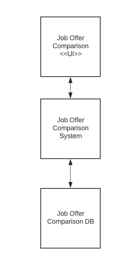
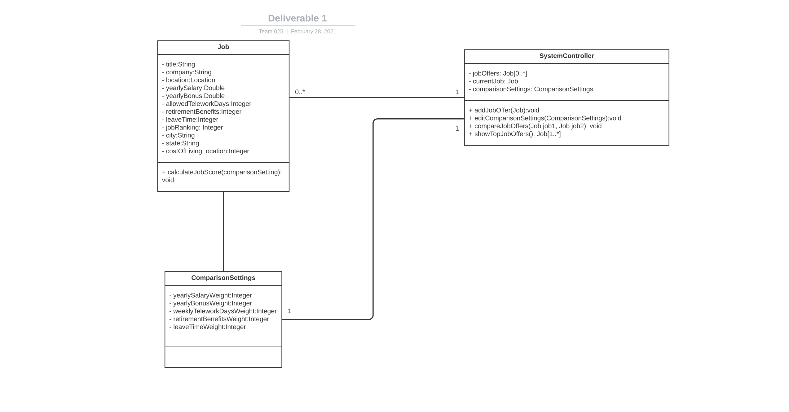
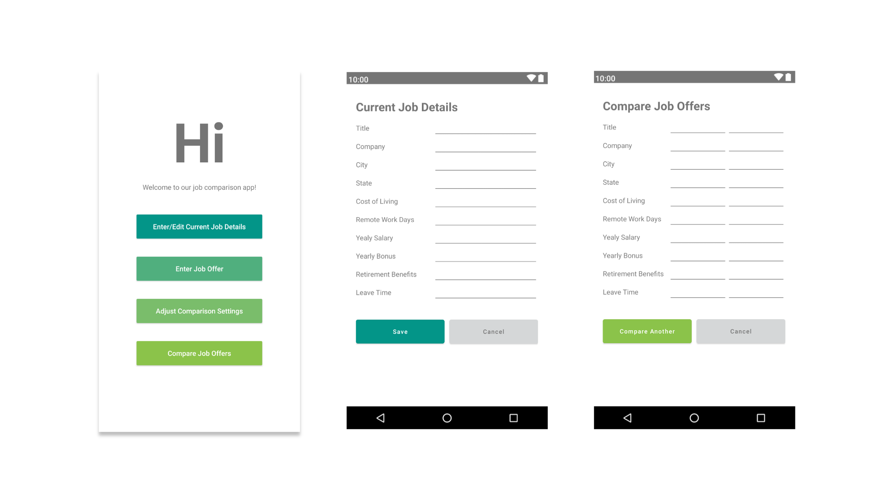
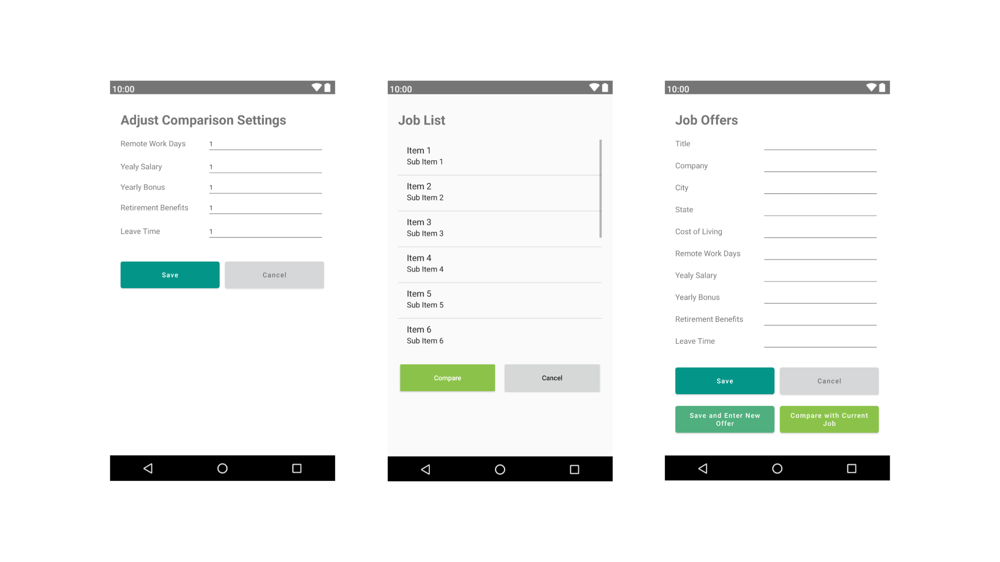

# Design Document

**Author**: \<Team025\>

## 1 Design Considerations

### 1.1 Assumptions

* The project assumes we are operating on devices that only support the Android operating system
    * The application will be written in Java
* We are assuming most Android devices support SQLite in order to persist data between user sessions
* This is a single system application so there will be no support for communication between
other devices

### 1.2 Constraints

Since we are operating as a single system application, we need to leverage natively available
storage options for persisting application state between runs.

### 1.3 System Environment

The system must operate on mobile devices supporting the Android operating system, specifically those devices supporting
API 28: Android 9.0 (Pie). Since we are developing an Android application, the underlying software of the application must be
written in Java since this is the officially supported programming language for Android applications. In addition,
the build tool we are leveraging is Gradle

## 2 Architectural Design

Below are the high level features of the Job Offer Comparison application

### 2.1 Component Diagram

The system consists of three main components which will all be self contained within the mobile
device. The Job Offer Comparison application consists of a UI and a backend system component (all part of a single Android
application). The UI will use the Job Offer Comparison System to display various data on the UI. The Job Offer Comparison System
will handle all interactions with the database (SQLite in this case). The database will leverage SQLite
which stores data to a text file on the device, hence why all the components are self contained
to the Android device

### 2.2 Deployment Diagram

Although there are three components defined above in the component diagram, all of these components are deployed
on the same hardware and no external communication protocols are required. The application will run on an Android device and
interact with a SQLite Database available natively on the device.

## 3 Low-Level Design

### 3.1 Class Diagram

The application component is composed of three main entities.
1. Job - This is a model which represents all the attributes we need to save related
to a job

2. ComparisonSettings - This is a singleton entity which represents the weight settings
assigned to several attributes used to compute job scores for rankings

3. SystemController - This is the entry-point class of our system and handles all the major
operations required by the application such as saving jobs, displaying jobs ranked by score,
adjusting comparison settings, etc.

## 4 User Interface Design
Below are the different pages a user will be able to see while navigating through the application:

