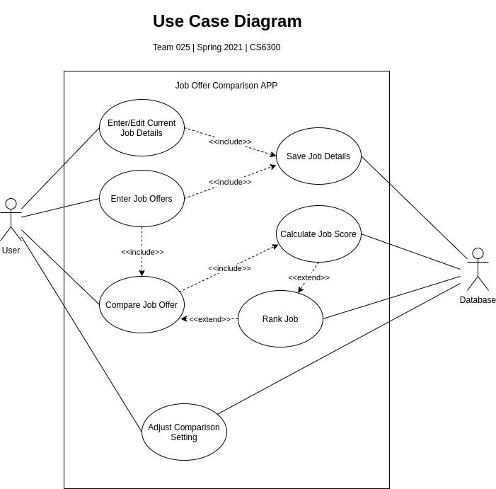

# Use Case Model

**Author**: \<Team025\>

## 1 Use Case Diagram

## 2 Use Case Descriptions

#### Enter/Edit Current Job Details
- *Requirements:*
    - Allow user enter or edit all the details of the current job offer.

- *Pre-conditions:*
    - User click "Enter/Edit Current Job Details" button.

- *Post-conditions:*
    - No blank or empty value for every inputed job details.
    - Input valid type of data for every inputed job details.

- *Scenarios:*
    1. User click "Enter/Edit Current Job Details" button to go to the Current Job Details screen.
    2. If current job is exist, retrieve current job details and show in Current Job Details screen
    3. If current job is not exist, show Current Job Details with empty table
    4. User input all necessary information for the job offer.
    5. If any invalid information is input, show alert icon
    6. User click buttons for different decision:
        - Click "Save" to save job detail into database.
        - Click "Cancel" to exit to MainMenu without save.

#### Enter Job Offer
- *Requirements:*
    - Allow user enter all the details of a new job offer.

- *Pre-conditions:*
    - User click "Enter Job Offer" button.

- *Post-conditions:*
    - No blank or empty value for every inputed job details.
    - Input valid type of data for every inputed job details.

- *Scenarios:*
    1. User click "Enter Job Offer" button to go to the Job Offer screen.
    3. APP Show empty table in Job Offer screen.
    4. User enter necessary information for the job offer.
    5. If any invalid information is input, show alert icon
    6. User click buttons for different decision:
        - Click "Save" to save job detail into database
        - Click "Cancel" to exit to Main Menu without save.
        - Click "Save and Enter New Offer" button to go to step 3.
        - Click "Compare with Current Job" to go to use case Compare Job Offers, send current job and entered new job to compare

#### Adjust Comparison Settings
- *Requirements:*
    - Allow user assign integer weights to comparison settings.
    - Allow user write the comparison settings in database

- *Pre-conditions:*
    - User click "Adjust Comparison Settings" button.

- *Post-conditions:*
    - All the settings should be valid input integer or leave with default input.
    - Only positive integer should allowed to be inputed.

- *Scenarios:*
    1. User click "Adjust Comparison Settings" button to go to the Adjust Comparison Settings screen.
    2. User input valid weight integers in every setting or leave default integer in.
    3. If invalid data is inputed, raise alert icon.
    3. User click buttons for different decision:
        - Click "Save" to save comparison settings. Write settings into database
        - Click "Cancel" to exit to MainMenu without save.

#### Compare Job Offer
- *Requirements:*
    - Allow user to select two valid job offers to compare job.
    - Allow user trigger Calculate Job Score use case.

- *Pre-conditions:*
    - User click "Compare Job Offers" button on Main Menu.
    - At lease two job offers have been saved in the system.
    - All job offers are showed in a Job Offers screen.
    - Only Title and Company are displayed in the list.
    - The job offers will be listed based on the ranking from best to worst.

- *Post-conditions:*
    - Two job offers have been selected.
    - User press "Compare" button.
    - A table of two jobs comparison is showed.

- *Scenarios:*
    1. User click "Compare Job Offers" button to activate compare job offers function.
        - If there are less than two job offers, stay in Main Menu
        - If there are two or more than two job offers, jump to Job Offers screen.
    2. A list of jobs' Title and Company shows up; jobs are ranked from best to worst.
    3. User select two jobs in the job list.
    4. User click "Compare" button.
    5. A table of job comparing shows up.
    6. User click followed buttons to execute next operation:
        - Click "Compare Another" to jump back to job list.
        - Click "Cancel" to exit to MainMenu.

#### Calculate Job Score
- *Requirements:*
    - Allow Database calculate the score of each job offer.

- *Pre-conditions:*
    - There is at least one valid job offer without job score
    - Comparison settings' factors are positive integer
    - Use Case "Compare Job Offer" is activated

- *Post-conditions:*
    - Job score = AYS + AYB + (RBP * AYS) + (LT * AYS / 260) - ((260 - 52 * RWT) * (AYS / 260) / 8)
    - See UserManual.md for details about this function

- *Scenarios:*
    1. Database select the job offer
    2. Database read the job offer's detail information
    3. Database calculate job score following given function
    3. Database do followed operation:
        - If there are more job offers need to be calculate score, select the next job and go to step 2.
        - If there are no more job offer, wait for calculate pre-condition reached.

#### Rank Job
- *Requirements:*
    - Allow Database rank and sort the job.

- *Pre-conditions:*
    - There are at least one valid job offer with valid job score
    - Use case "Compare Job Offer" is activated

- *Post-conditions:*
    - Job offers are sorted by job score in descending sequence

- *Scenarios:*
    1. User click "Compare Job Offer" button
    2. Database read the job score from every valid job offer
    2. Database rank the job score from highest to lowest sequence
    3. Database sort the job offers by the sequence of job score ranking
    4. APP show the sorted job offer list in GUI

#### Save Job Details
- *Requirements:*
    - Allow database save the job details information in database.

- *Pre-conditions:*
    - User click "Save" button.
    - User input valid job details information.

- *Post-conditions:*
    - Inputed job details information is saved in database

- *Scenarios:*
    1. Database read all job detail information from APP
    2. If the job offer is not exist in database:
        - create a new job offer record in database
        - write all job detail information in that job offer record
    3. If the job offer is exist in database:
        - update job detail information of that job offer record
