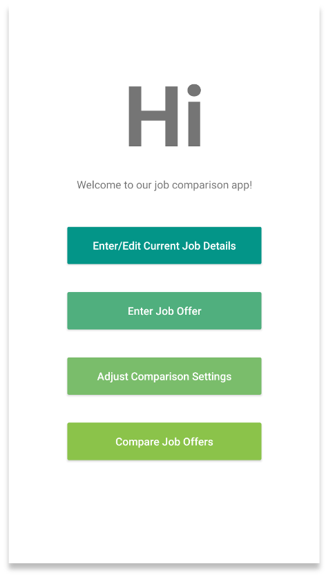
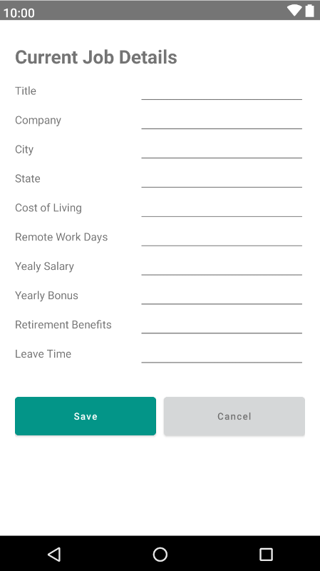
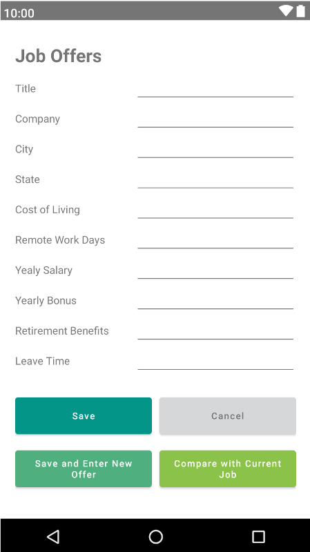
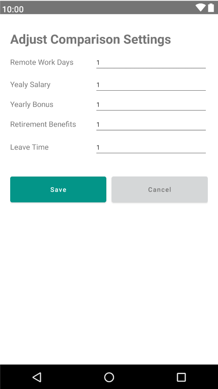
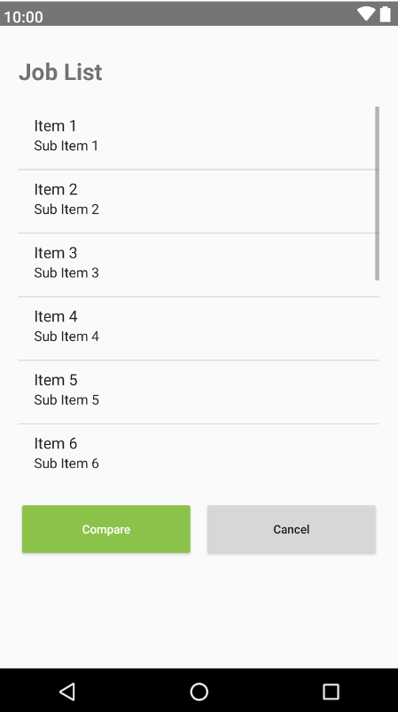
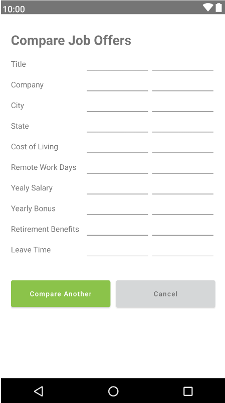

This is a single-user **Job Comparison** app with the purpose of comparing job offers with benefits, locations, and other aspects beyond salary by adjusting personal preferences in the app.

**Author**: \<Team025\>

## Snapshot

Below are the different pages a user will be able to see while navigating through the application:

See sessions below for details:
1. Main page
2. Current Job Offer page
3. Job Offers page
4. Adjust Comparison Settings page
5. Job List page
6. Compare Job Offers page

## 1. Main page

When the app is started, the user is presented with the main menu.

**Buttons:**
- *Enter/Edit Current Job Details* button will allow user to jump to session 2 *Current Job Offer* page to enter or edit current job details
- *Enter Job Offer* button will allow user to jump to session 3 *Job Offers* page to enter a new job offer
- *Adjust Comparison Settings* button will allow user to jump to session 4 *Adjust Comparison Settings* page to change the setting of the weights
- *Compare Job Offers* button will allow user to jump to session 5 *Job List* page to see all saved jobs

**Rule(s):**
- Compare Job Offers button will be disabled if no job offers were entered yet

## 2. Current Job Offer page

When choosing to enter current job details, the user can enter (if it is the first time) or edit all of the details of their current job, which consist of Title, Company, City, State, Cost of Living, Yearly Salary, Yearly Bonus, Allowed Weekly Telework Days, Retirement benefits, and Leave Time.

**Buttons:**
- *Save* button will allow user to save the current job details for future reference and return to the main menu.
- *Cancel* button will allow user to exit without saving and return to the main menu.

**Rule(s):**
- Title, Company, City and State should be a sequence of characters (text)
- Cost of Living, Yearly Salary, Yearly Bonus should be integers
- Remote Work Days will expressed as the number of days per week allowed for remote work, inclusively between 0 and 5
- Retirement Benefits will be expressed as percentage matched, inclusively between 0 and 100
- Leave Time is vacation days and holiday and/or sick leave, as a single overall number of days

## 3. Job Offers page

When choosing to enter job offers, the user can enter all of the details of the offer, which are the same ones listed above for the current job.

**Buttons:**
- *Save* button will allow user to save the job offer details for future reference and return to the main menu
- *Cancel* button will allow user to exit without saving and return to the main menu
- *Save and Enter New Offer* button will allow user to save the current job offer details and enter a new job offer with details
- *Compare with Current Job* button will allow user to save the current job offer details and compare it with the details of the current job if it exists

**Rule(s):**
- Same as Current Job Offer rules above

## 4. Adjust Comparison Settings page

When adjusting the comparison settings, the user can assign integer weights to: Yearly salary, Yearly bonus, Allowed Remote Work Days, Retirement benefits, and Leave time.

**Buttons:**
- *Save* button will allow user to save the comparison weights details for future reference and return to the main menu.
- *Cancel* button will allow user to exit without saving and return to the main menu.

**Rule(s):**
- All weights will be expressed as integers, inclusively between 1 and 10; all default weights will be 1

## 5. Job List page

When choosing to compare job offers, the user will see a list of job offers, displayed as Title and Company, ranked from best to worst (see below for details), and including the current job (if present).

**Buttons:**
- User will be able to select two jobs for comparison (including current job) and press *Compare* button, which will jump to Session 6 *Compare Job Offer* page.
- *Cancel* button will allow user to exit and return to the main menu.

**Rule(s):**
- When ranking jobs, a job’s score is computed as the weighted sum of:
  AYS + AYB + (RBP * AYS) + (LT * AYS / 260) - ((260 - 52 * RWT) * (AYS / 260) / 8)

  The rationale for the RWT formula is:
  - value of an employee hour = (AYS / 260) / 8
  - commute hours per year (assuming a 1-hour/day commute) = 1 * (260 - 52 * RWT)
  - therefore travel-time cost = (260 - 52 * RWT) * (AYS / 260) / 8

  where:
  - AYS = yearly salary adjusted for cost of living
  - AYB = yearly bonus adjusted for cost of living
  - RBP = retirement benefits percentage
  - LT = leave time
  - RWT = remote work days per week

## 6. Compare Job Offers page

When choosing two job offers (including one or none current job) to compare job offers, the user will see a table comparing the two jobs, which consist of Title, Company, City, State, Cost of Living, Yearly Salary, Yearly Bonus, Allowed Remote Work Days, Retirement benefits, and Leave Time.

**Buttons:**
- *Compare Another* button will allow user to go back/jump to Session 5 *Job List* page to select two jobs for comparison.
- *Cancel* button will allow user to exit and return to the main menu.
