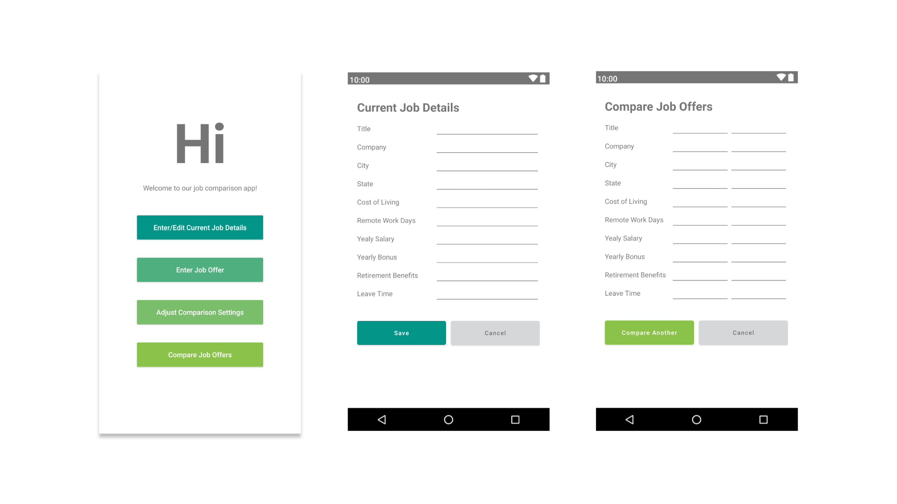

# Andorid App - JobCompare
This is a single-user **Job Comparison** app with the purpose of comparing job offers with benefits, locations, and other aspects beyond salary by adjusting personal preferences in the app.

This is the course project of CS6300 - Software Development Process in Georgia Institute of Technology in the semester of Spring 2021

## Installation Instruction
1. Copy the app_debug.app in cellphone
2. Install the app_debug.app
3. Run the App

## Snapshot

Below are the different pages a user will be able to see while navigating through the application:

## Team Member
Gopal Hari, Zhang Liang, Qiwei Han, Ithene Lin